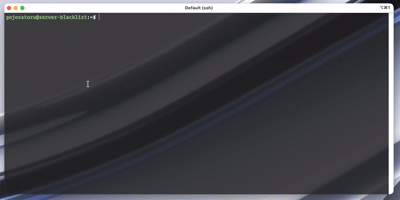

# dps

A readable `docker ps`.



## Features

- **Fits the terminal.** The table fits the window width. Columns that do not
  fit are dropped, and `dps` says which ones on stderr.
- **Groups by compose project.** Or shows a flat list with `-g=false`.
- **Interactive view.** Cursor, scroll, and live refresh every two seconds.
  Changed rows show bold for a moment.
- **Live CPU graph.** Add the `cpu` column to see a small graph of each
  container's CPU next to the number.
- **Stats view.** Press `s` for CPU, memory, disk and network charts of the
  selected container.
- **Shell in one key.** Press `e`, then `y`, to open `bash` (or `sh`) in the
  selected container.
- **Pipe friendly.** In a pipe, the output is a plain table with no colour, so
  `grep` and `awk` work. `--json` gives one record per line.
- **Your columns.** Press `c` to tick columns and see the result at once, or
  use flags. Save a default and presets.
- **Short first-run setup.** Two questions, then done. Every answer is also a
  flag.
- **Read-only.** `dps` never starts, stops or removes a container.

## Requirements

- Linux or macOS, on `amd64` or `arm64`.
- Docker Engine on a unix socket. `tcp://` and `ssh://` are not supported.
- Access to the Docker socket: your user is in the `docker` group, or root.
- A UTF-8 terminal.
- To build from source: Go 1.25 or newer.

## Install

```sh
curl -fsSL https://raw.githubusercontent.com/developerabdan/dps/main/install.sh | sh
```

The script checks the requirements, downloads the release for your platform,
verifies the checksum, and installs one file. It never asks for a password.

With Go (the binary goes to `$(go env GOPATH)/bin`):

```sh
go install github.com/developerabdan/dps/cmd/dps@latest
```

Installer options, upgrade and uninstall: [USAGE.md](USAGE.md#install-options).

---

Usage, keys, columns and configuration: [USAGE.md](USAGE.md).
MIT license, see [LICENSE](LICENSE).
